# Configurar notificaciones en React Native

## Añadir `Notificaciones Push` en su aplicación

Por favor revise las diferencias entre el commit `chore: init` y `chore: finished settings`

---

## El ambiente utilizado para realizar configuración es

    npm: 8.11.0
    node: 16.15.1
    react: 16.13.1
    react-native: 0.63.3
    react-native-push-notification: 8.1.1

## Importante!!

Para que el proyecto funcione, `es obligatorio añadir el google-service.json al proyecto y que la aplicación se instale en un dispositivo físico`, para configurar el proyecto, por favor siga los pasos

Después de haber configurado los pasos correctamente, ejecute

```bash
yarn

yarn android
```

---

## Paso 1. Crear cuenta en Firebase y añádele una aplicación de android, debería verse asi

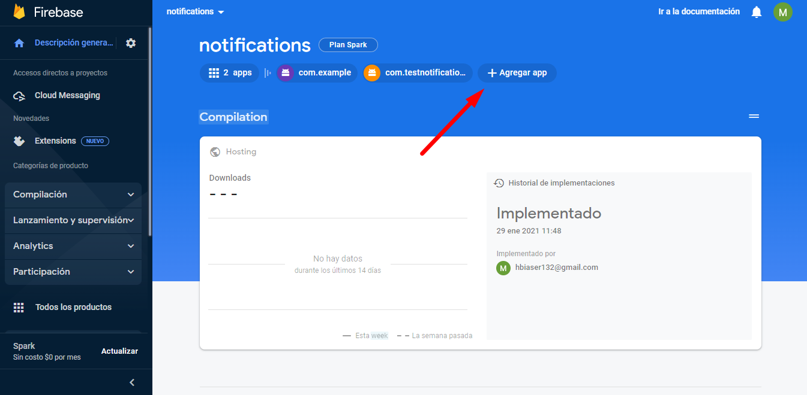
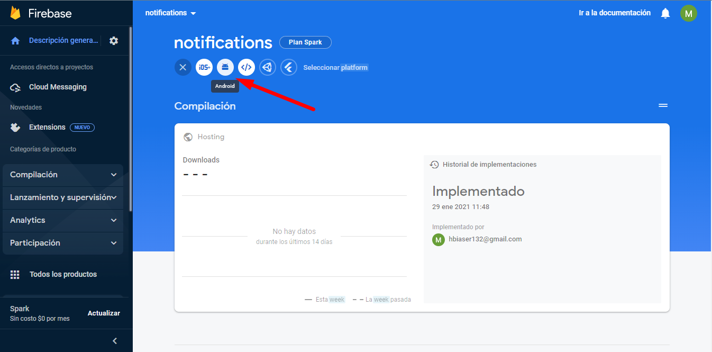
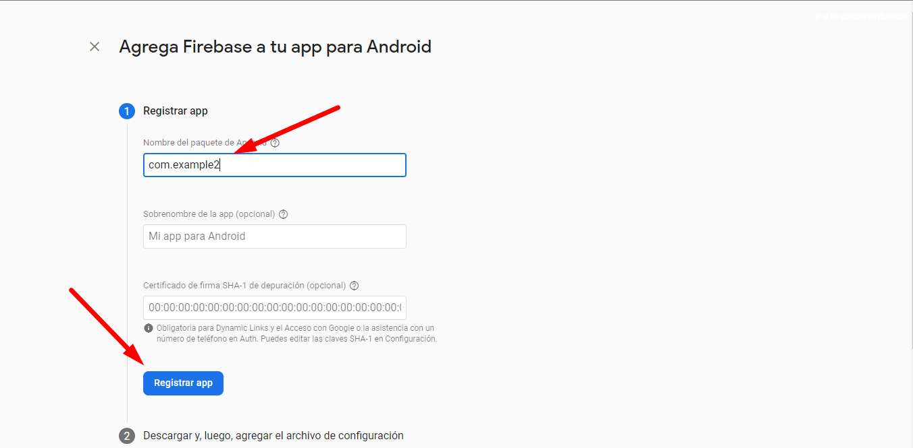
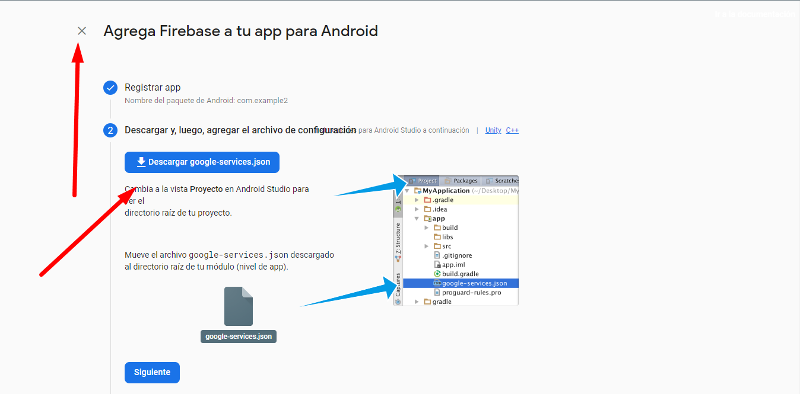
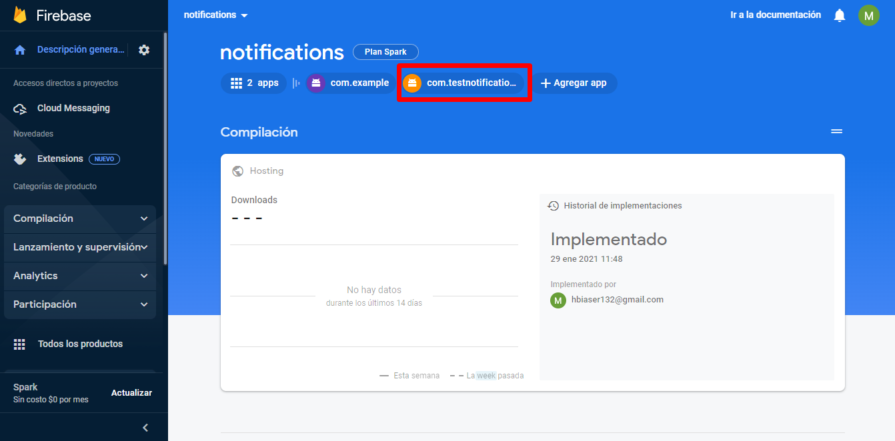

## Paso 2. Obtén el google-service.json

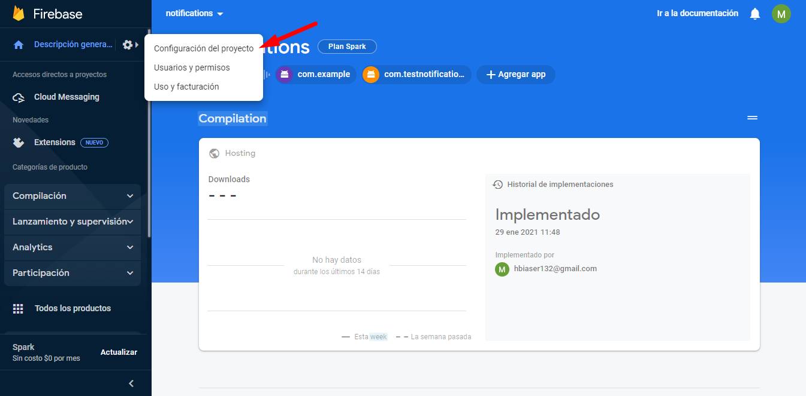
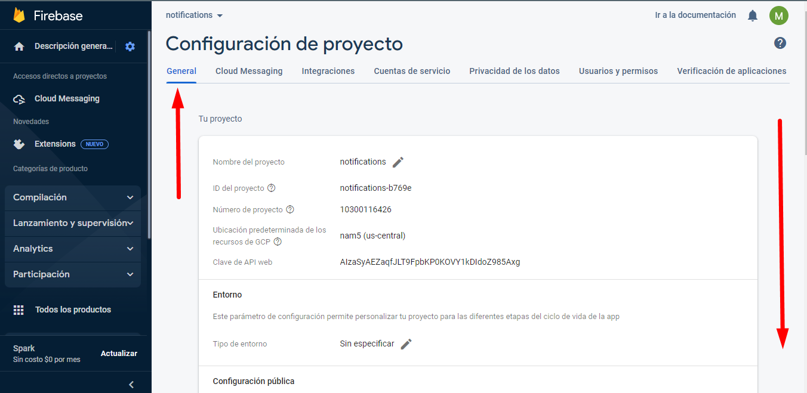
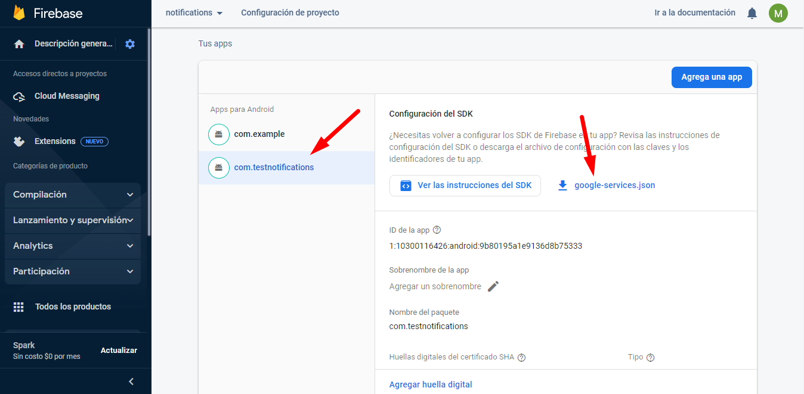

## Paso 3. Añade el google-service.json al proyecto

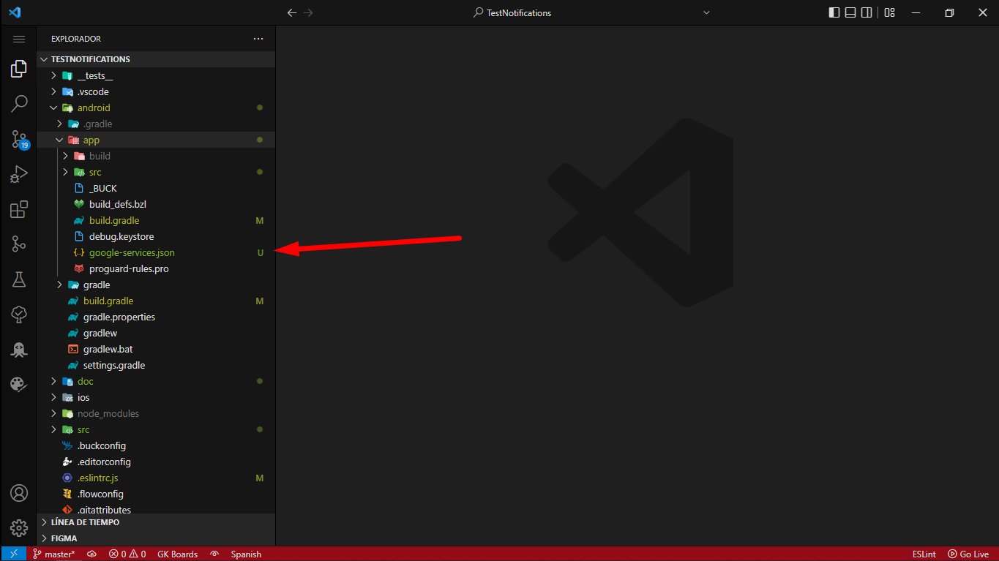

## Paso 4. Obtén el token del servidor, se utiliza para enviar notificaciones push


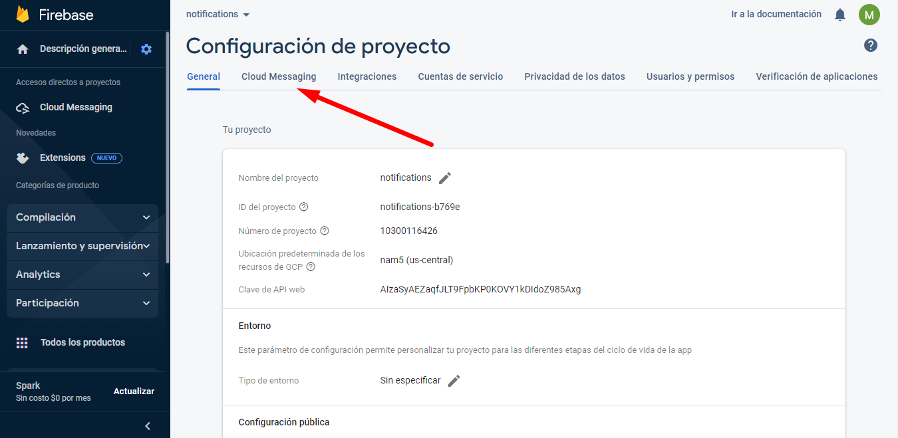
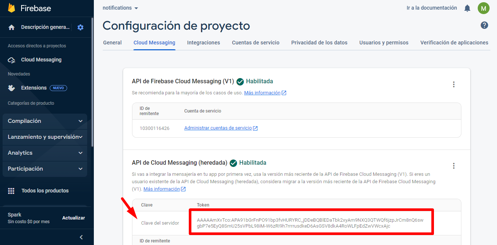

## Enviando notificaciones


## cURL para enviar `Notificaciones Push`

Datos necesarios para que la petición funcione

1. Header: Authorization: key=`Firebase-Server-Token` // -> Se obtiene en la configuración de Firebase
2. Body: to: `Device-Token` // -> Se obtiene al momento de integrar el paquete `react-native-push-notification` en la aplicación

Puede importar este cURL en su cliente REST de confianza (Postman, Rapid API ...) para tener una idea de como enviar notificaciones

```bash
curl --location --request POST 'https://fcm.googleapis.com/fcm/send' \
--header 'Authorization: key=Firebase-Server-Token' \
--header 'Content-Type: application/json' \
--data-raw '{
    "notification": {
        "body": "this is a body",
        "title": "this is a title"
    },
    "priority": "high",
    "data": {
        "click_action": "FLUTTER_NOTIFICATION_CLICK",
        "id": "1",
        "status": "done",
        "uid": "encanta eso"
    },
    "to": "Device-Token"
}'
```
